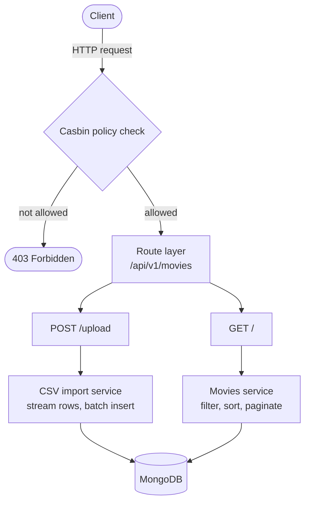

# Content Upload and Review System

A Flask + MongoDB service for the content team to upload movie data from a CSV
file and browse it through a paginated, filterable and sortable API.

## Features

- **CSV upload** that streams rows into MongoDB in batches, so files up to 1GB
  are never loaded fully into memory.
- **Movie listing** with filtering by year of release and language, and sorting
  by release date or rating (ascending and descending). Sorts are index-backed
  and push empty values last; both offset and keyset (cursor) pagination are
  supported. See [Pagination, sorting and scale](#pagination-sorting-and-scale).
- Casbin-based authorization driven by a `model.conf` / `policy.csv` pair.
- A simple web UI (upload + list view) served by the backend at `/`.

## Architecture



A request first passes the casbin check in middleware, then a thin route hands
off to a service that does the work and talks to MongoDB. Indexes on `year`,
`original_language`, `languages`, `release_date` and `vote_average` back the
filters and sorts.

## Project layout

```
app/
  casbin/      authorization model and policy
  common/      response envelope, errors, query-param parsing
  middleware/  request-time policy enforcement
  models/      movie document schema and (de)serialization
  route/       HTTP endpoints (thin handlers)
  service/     business logic (CSV import, list queries)
  config.py    environment-driven settings
  db.py        MongoDB connection and indexes
web/           static single-page UI (upload + list view)
tests/         integration tests (run against an in-memory MongoDB)
postman/       Postman collection
```

Routes stay thin and delegate to the service layer, keeping handlers easy to
read and the business logic independently testable.

## Quick start with Docker

Brings up the API and MongoDB together with a single command:

```bash
docker compose up --build
```

The service is then available at `http://localhost:5000`. Stop it with
`docker compose down` (add `-v` to also drop the database volume).

## Manual setup

Requirements: Python 3.11+ and a reachable MongoDB instance.

```bash
python3 -m venv .venv
source .venv/bin/activate
pip install -r requirements.txt
cp .env.example .env   # adjust MONGO_URI if needed
```

If you do not have MongoDB locally, start one with Docker:

```bash
docker run -d -p 27017:27017 --name content-review-mongo mongo:7
```

Then run the app:

```bash
flask --app wsgi run            # development
# or
gunicorn wsgi:app -b 0.0.0.0:5000   # production-style
```

The service listens on `http://localhost:5000`.

## Web UI

A simple single-page UI is served by the backend at the root URL — open
[http://localhost:5000/](http://localhost:5000/) in a browser. It has a CSV
upload control and a paginated, filterable, sortable list view. Because it is
served from the same origin as the API, it works the same whether you run via
Docker or run MongoDB and the backend separately; no extra setup is needed.

## API

All movie endpoints sit under `/api/v1/movies` and expect an `X-Role` header
(defaults to `default_role`, which the bundled policy allows).

### Upload a CSV

```
POST /api/v1/movies/upload
Content-Type: multipart/form-data
field: file=<movies.csv>
```

```bash
curl -X POST http://localhost:5000/api/v1/movies/upload \
  -F "file=@/path/to/movies.csv"
```

Response:

```json
{ "success": true, "data": { "inserted": 45000, "skipped": 12 } }
```

Rows without a title are skipped and reported in `skipped`.

### List movies

```
GET /api/v1/movies
```

| Query param  | Description                                          |
|--------------|------------------------------------------------------|
| `page`       | Page number, default `1`                             |
| `page_size`  | Items per page, default `20`, capped at `100`        |
| `year`       | Filter by year of release                            |
| `language`   | Filter by language; repeat the param to require all of them (AND) |
| `sort_by`    | `release_date` or `rating`                           |
| `sort_order` | `asc` or `desc`, default `asc`                        |
| `after`      | Keyset cursor for deep pagination (see below)        |

**Sorting and empty values:** part of the source data has no `release_date`
(and some no `rating`). When sorting by such a field, those records are always
returned **last** — in both ascending and descending order. This is a
deliberate choice: the records are still included in the results and in
`total`, but real values are never pushed off the front of the list by empty
ones.

```bash
# movies that are in BOTH English and Français
curl "http://localhost:5000/api/v1/movies?language=English&language=Fran%C3%A7ais&sort_by=rating&sort_order=desc"
```

### List languages

Returns the distinct languages present in the data, sorted — used to populate
the filter dropdown.

```
GET /api/v1/movies/languages
```

```json
{ "success": true, "data": ["English", "Español", "Français", "..."] }
```

Response:

```json
{
  "success": true,
  "data": {
    "items": [ { "title": "Toy Story", "vote_average": 7.7, "...": "..." } ],
    "page": 1,
    "page_size": 20,
    "total": 2,
    "total_pages": 1,
    "next_cursor": "W3sidCI6ImJvb2wi...",
    "has_more": false
  }
}
```

## Pagination, sorting and scale

The CSV can be up to 1GB, so the list endpoint is built to stay fast as the
collection grows. The decisions below are deliberate.

**Sorting is index-backed, empty values last.** MongoDB has no native
`NULLS LAST`, and sorting on a value computed at query time forces a blocking
in-memory sort (capped at 100MB). Instead, a boolean flag (`has_release_date`,
`has_rating`) is computed once at upload time and indexed alongside the sort
field. The sort `{flag desc, field, _id}` is served entirely by an index
(`IXSCAN`, no `SORT` stage), and records with no value land last in both
directions while remaining in the results and the count.

**Two pagination modes, same sort.**

- *Offset* (default) — `page` / `page_size`, returns `total` and `total_pages`.
  Best for the CRM's page-number UI. `skip` cost grows with depth, so it is
  meant for shallow page jumps; `page_size` is capped at 100.
- *Keyset* (cursor) — pass `after=<next_cursor>` from the previous response to
  seek past the last seen record. Each page is an indexed lookup, so it stays
  fast at any depth. Use it for deep traversal or exporting the whole set.

```bash
# page 1
curl "http://localhost:5000/api/v1/movies?sort_by=rating&sort_order=desc&page_size=50"
# page 2 onward: feed back next_cursor
curl "http://localhost:5000/api/v1/movies?sort_by=rating&sort_order=desc&page_size=50&after=<next_cursor>"
```

Every response includes `next_cursor` and `has_more`, so a client can start on
offset and switch to keyset without changing the sort. Trade-off: keyset has no
"jump to page N" — that is what offset is for. The exact `total` count is only
computed in offset mode, since counting the full collection on every keyset page
would defeat the purpose.

### References

These choices follow established guidance on sorting and pagination at scale:

- [MongoDB `$sort` (aggregation) — index use and the blocking in-memory sort](https://www.mongodb.com/docs/manual/reference/operator/aggregation/sort/)
- [Sorting ZERO/NULL values last with a precomputed flag](https://tevpro.com/how-to-sort-zero-or-null-values-last-in-mongodb/)
- [MongoDB Community — customising how null/missing fields sort](https://www.mongodb.com/community/forums/t/new-customize-how-to-sort-documents-with-null-or-missing-fields/307938)
- [Fast and efficient pagination in MongoDB (keyset on the sort key + `_id`)](https://www.codementor.io/@arpitbhayani/fast-and-efficient-pagination-in-mongodb-9095flbqr)
- [MongoDB pagination, fast and consistent (offset vs keyset)](https://medium.com/swlh/mongodb-pagination-fast-consistent-ece2a97070f3)
- [Optimizing MongoDB pagination](https://scalegrid.io/blog/mongodb-pagination/)

## UX decisions

A few behaviours are deliberate product choices rather than incidental:

- **Language filter is multi-select with AND semantics.** The options are pulled
  from the data itself (`/api/v1/movies/languages`). Selecting one language
  shows movies in that language; selecting a second narrows the list to movies
  available in *both* (their intersection), not the union. This matches how a
  content team thinks — "show me titles I can ship in English and Spanish."
- **The language list is global and precomputed, not contextual.** The dropdown
  shows every language in the dataset, not just those matching the current
  filters. Contextual facets would mean a `distinct` with a filter, which the
  query planner resolves by fetching every matching document (`FETCH + IXSCAN`)
  — too costly at 1GB and really a search-engine job. Instead the language set
  is maintained on upload and stored in a small `facets` document, so the
  dropdown is a single-document (`IDHACK`) read whose cost does not grow with
  the collection. A filter combination that matches nothing simply returns an
  empty list.
- **A rating only counts when the movie has votes.** Many records carry a
  `0.0` average simply because they have zero votes — that is "unrated", not a
  genuine low score. So a movie with no votes is treated the same as a missing
  rating and sorted to the end (in both directions), instead of polluting the
  top of an ascending sort. A `0.0` backed by real votes is kept as a true low
  score.
- **Empty sort values always sort last.** See
  [Pagination, sorting and scale](#pagination-sorting-and-scale).

## Design decisions

The main engineering choices, in one place:

- **Layered structure.** Thin routes delegate to a service layer, with models
  and a casbin policy kept separate, so handlers stay readable and the logic is
  testable on its own.
- **Streaming, batched import.** The CSV is read row by row and inserted in
  batches, so a 1GB upload never has to sit in memory.
- **Write-time precomputation.** Null-sort flags (`has_release_date`,
  `has_rating`), a derived `year`, and the language facet are all computed once
  on upload so reads stay cheap and index-backed.
- **Index-backed sorting, empty values last**, with offset *and* keyset
  pagination — see [Pagination, sorting and scale](#pagination-sorting-and-scale).
- **Standard response envelope** (`{ success, data }` / `{ success, error }`)
  and strict query-parameter validation.
- **Authorization via casbin** (`model.conf` + `policy.csv`); the caller role is
  read from an `X-Role` header for demonstration.

## Possible improvements

Conscious trade-offs and where this would go next:

- **A stable movie id for idempotent uploads.** The source CSV has no unique
  key, so re-uploading the same file inserts duplicate documents. Introducing a
  stable identifier — ideally the source's own movie id (e.g. a TMDB/IMDb id),
  or failing that a deterministic natural key such as normalised
  `title + release_date` — would let the importer do an **upsert**
  (`bulk_write` with `update_one(..., upsert=True)`) keyed on it. Re-uploads
  would then update existing records instead of duplicating them, and the
  language facet and counts would stay correct across re-imports.
- **Facet rebuild on delete.** The language facet only accumulates today, which
  is correct because records are never removed. Adding delete support would
  require rebuilding (or reference-counting) the facet.
- **Contextual / faceted filtering** (language counts within the current
  filters) is better served by a search engine such as Atlas Search or
  Elasticsearch than by scaling a filtered `distinct`.
- **Targeted compound indexes** (full ESR coverage) for any specific
  filter-plus-sort combination that shows up hot in profiling.
- **Real authentication / RBAC** (JWT or Keycloak) feeding the casbin role,
  instead of the demonstration `X-Role` header.

## Testing

Integration tests run against an in-memory MongoDB (`mongomock`), so no database
is required:

```bash
pip install -r requirements-dev.txt
pytest
```

A Postman collection is available at
`postman/content-review-system.postman_collection.json`.

## AI assistance

AI was used for the following parts of this project:

- Writing the integration tests.
- Writing the Postman collection.
- Building the static web page.
- Help with the README architecture diagram.
- Research into the best approach for handling the data volume (sorting and
  pagination at scale).
